A project of a portfolio and blog website. Technologies: HTML, CSS and JavaScript.

Some screenshots from the project:

1. Home:

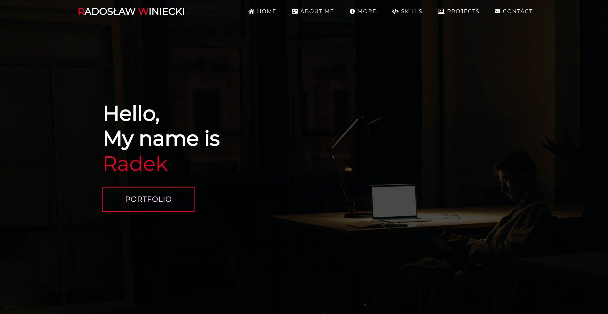

2. About Me:

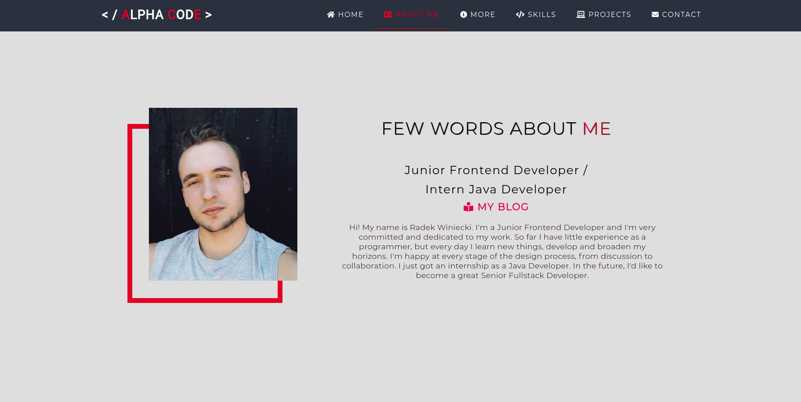

3. Experience and Education:

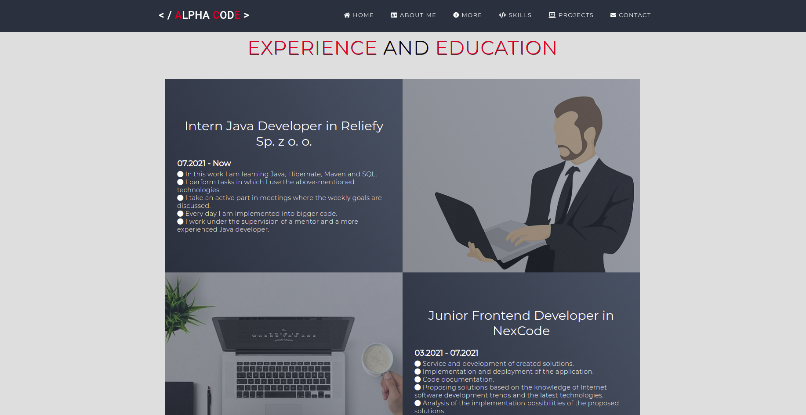

4. Technologies:

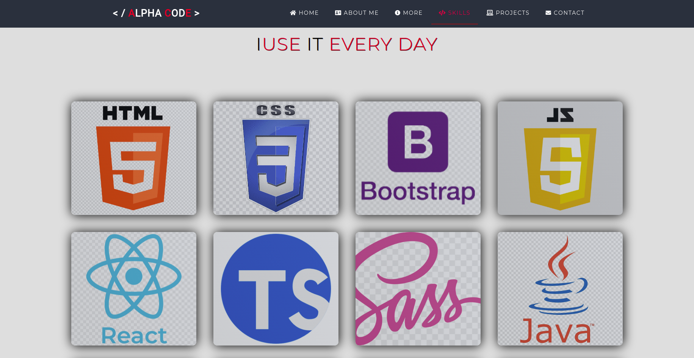

5. Projects:

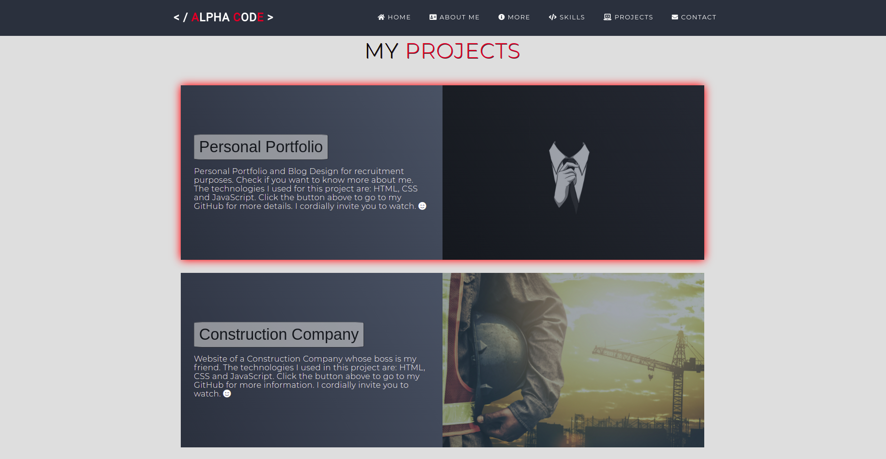

6. Contact and Footer:

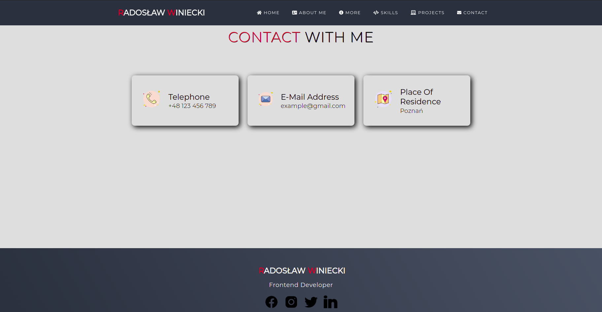

7. Blog Website:

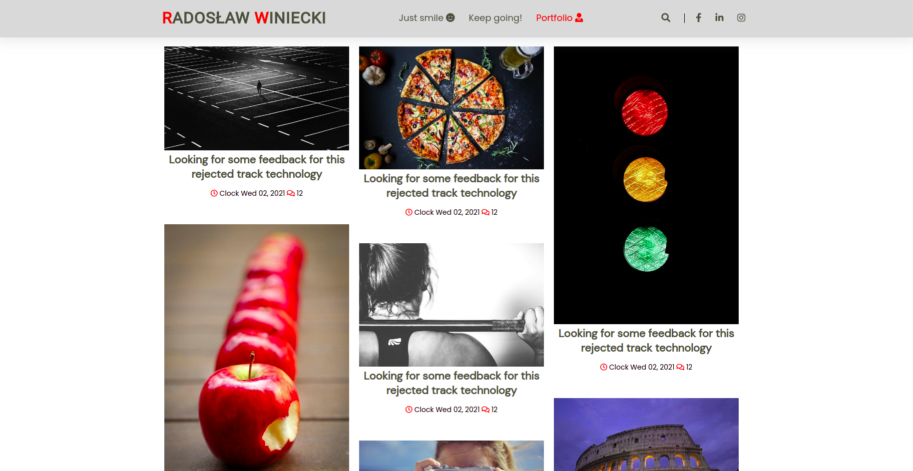

8. Slider and Footer:

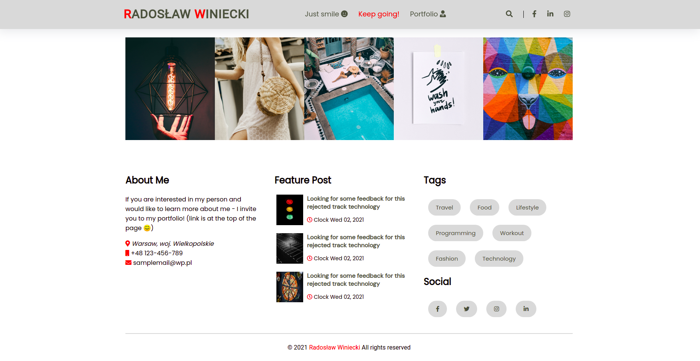

9. Article:

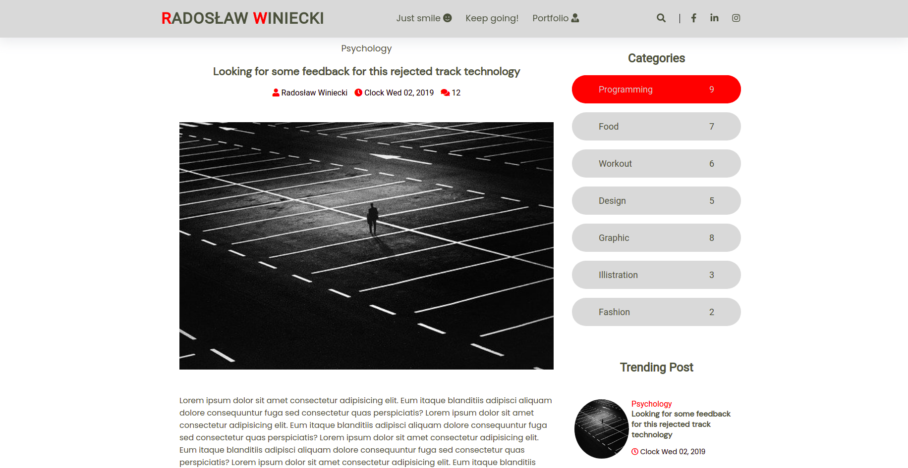

10. Prev/Next Post and Comments:

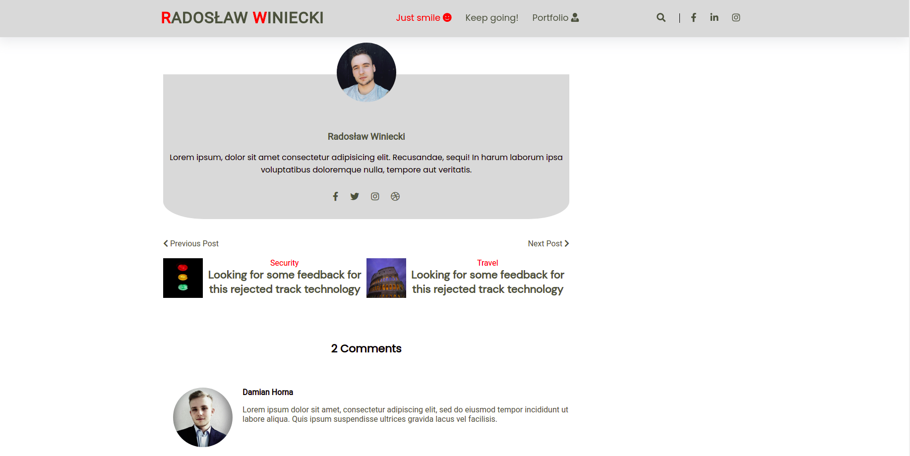

11. Leave Comment:

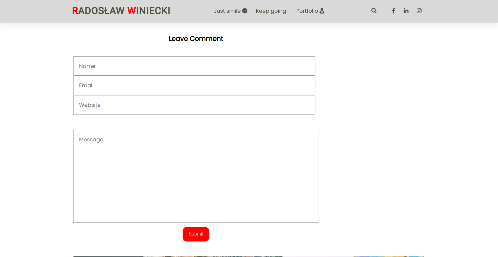
