A project of a portfolio and blog website. Technologies: HTML, CSS and JavaScript.

Some screenshots from the project:

1. Home:

2. About Me:

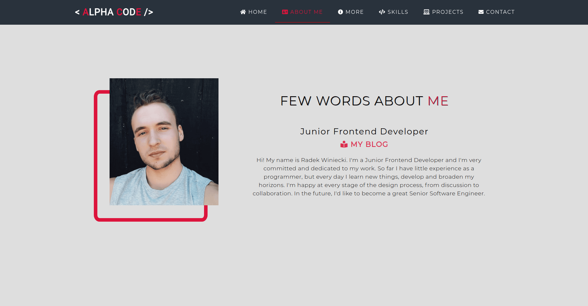

3. Experience and Education:

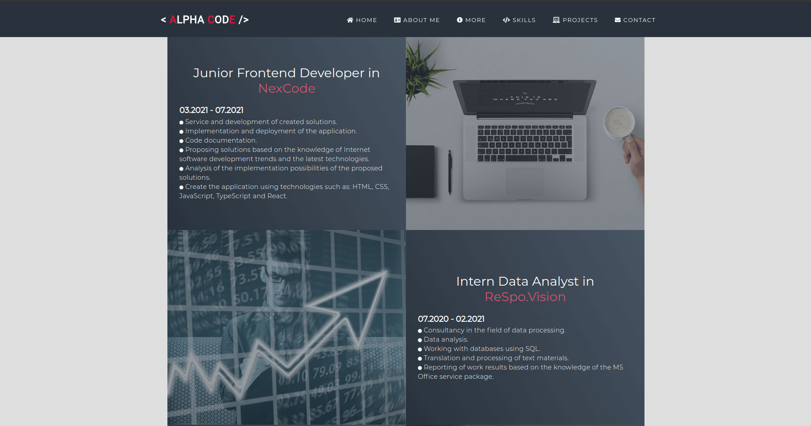

4. Technologies:

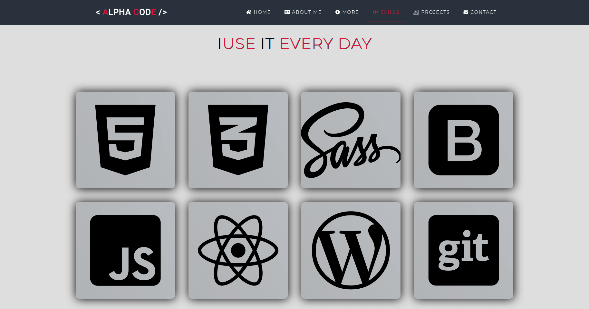

5. Projects:

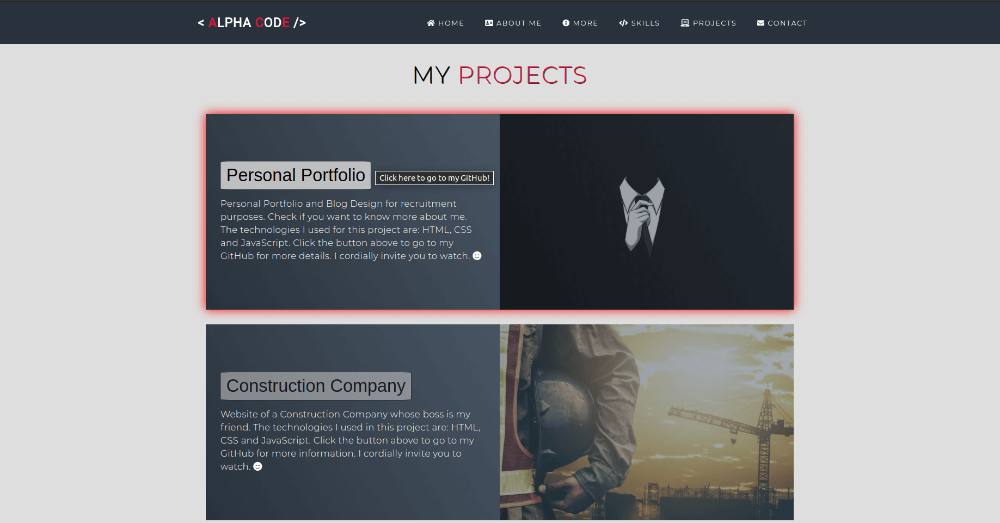
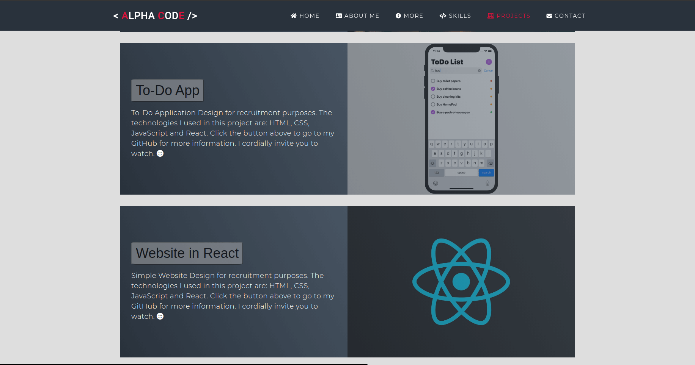

6. Contact:

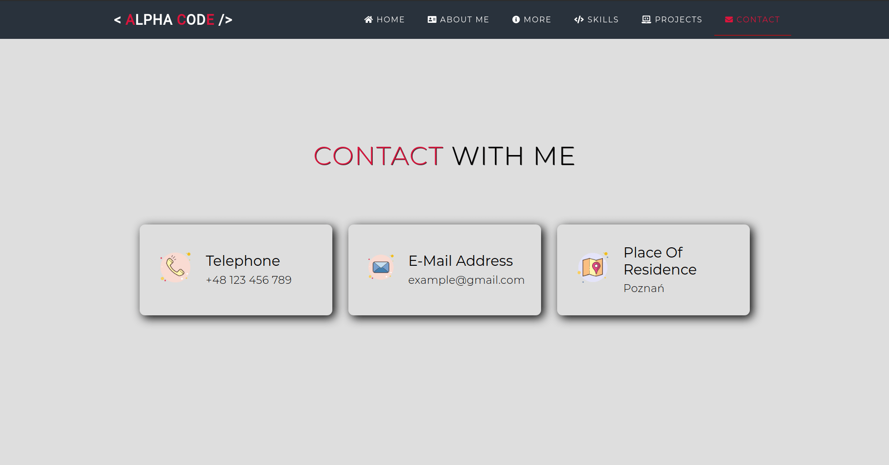

7. Localization and Footer:

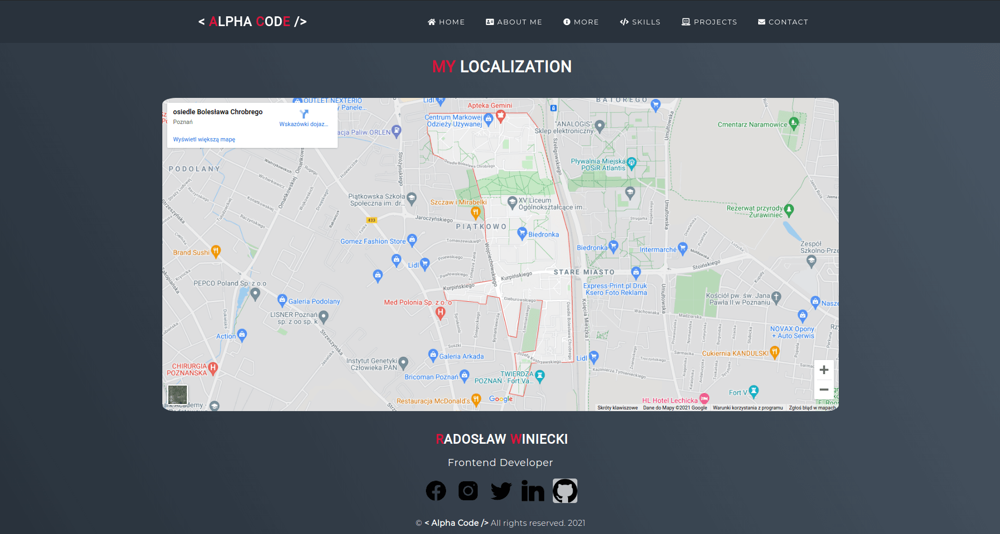

8. Blog:

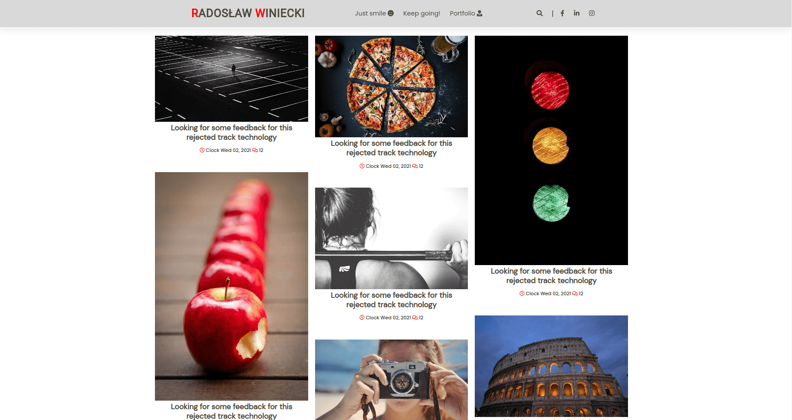

9. Slider and Footer:

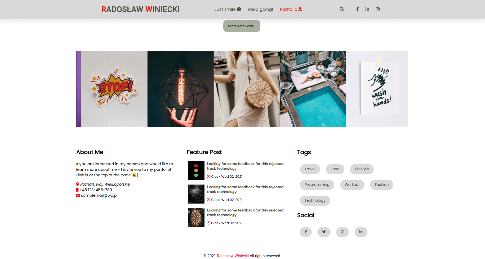

10. Article:

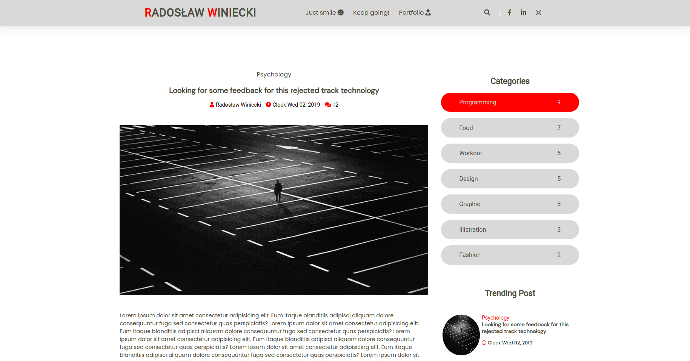

11. Prev/Next Page and Comments:

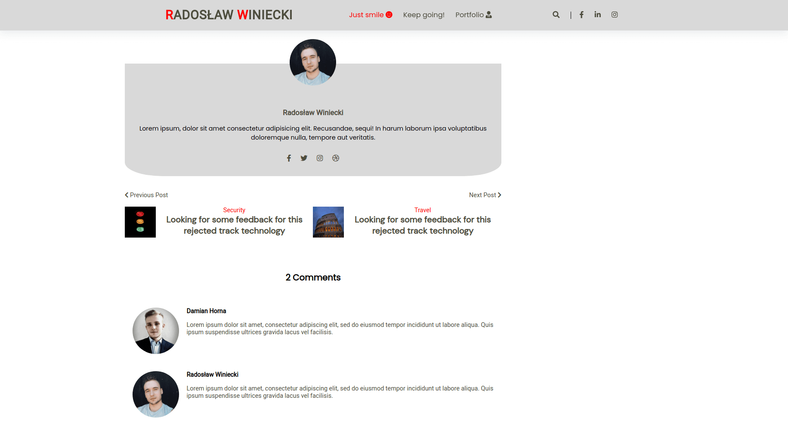
